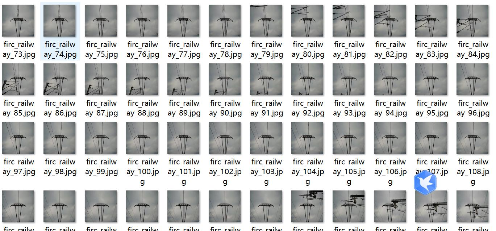
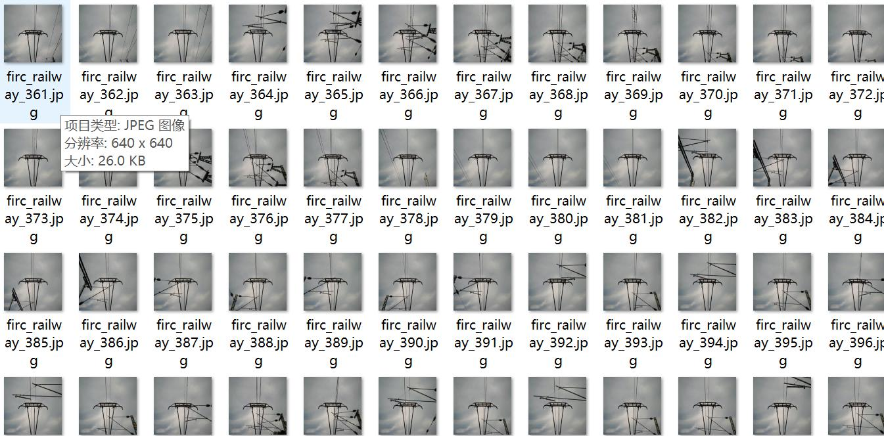
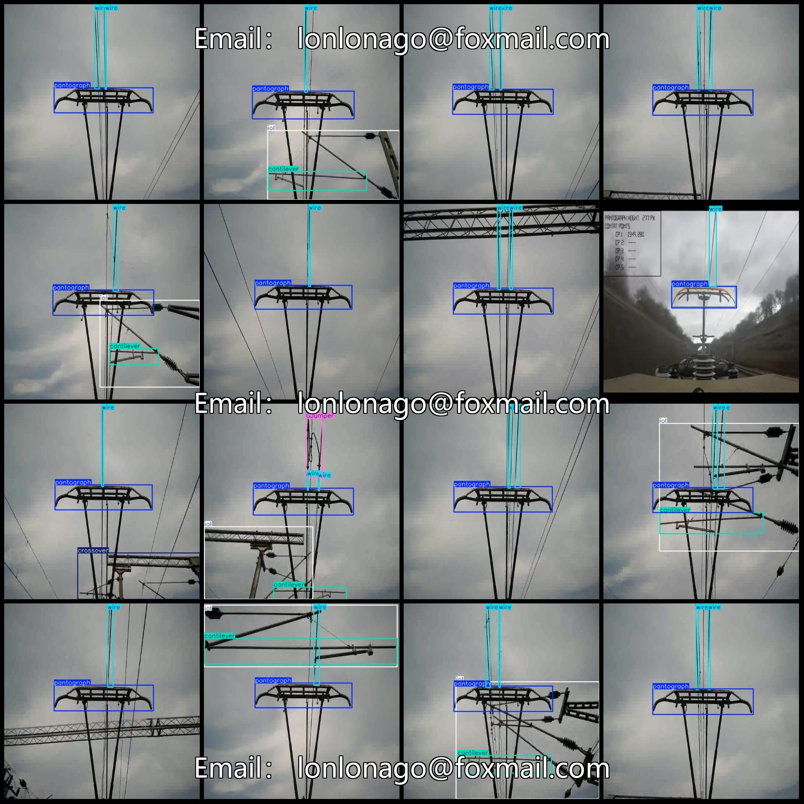
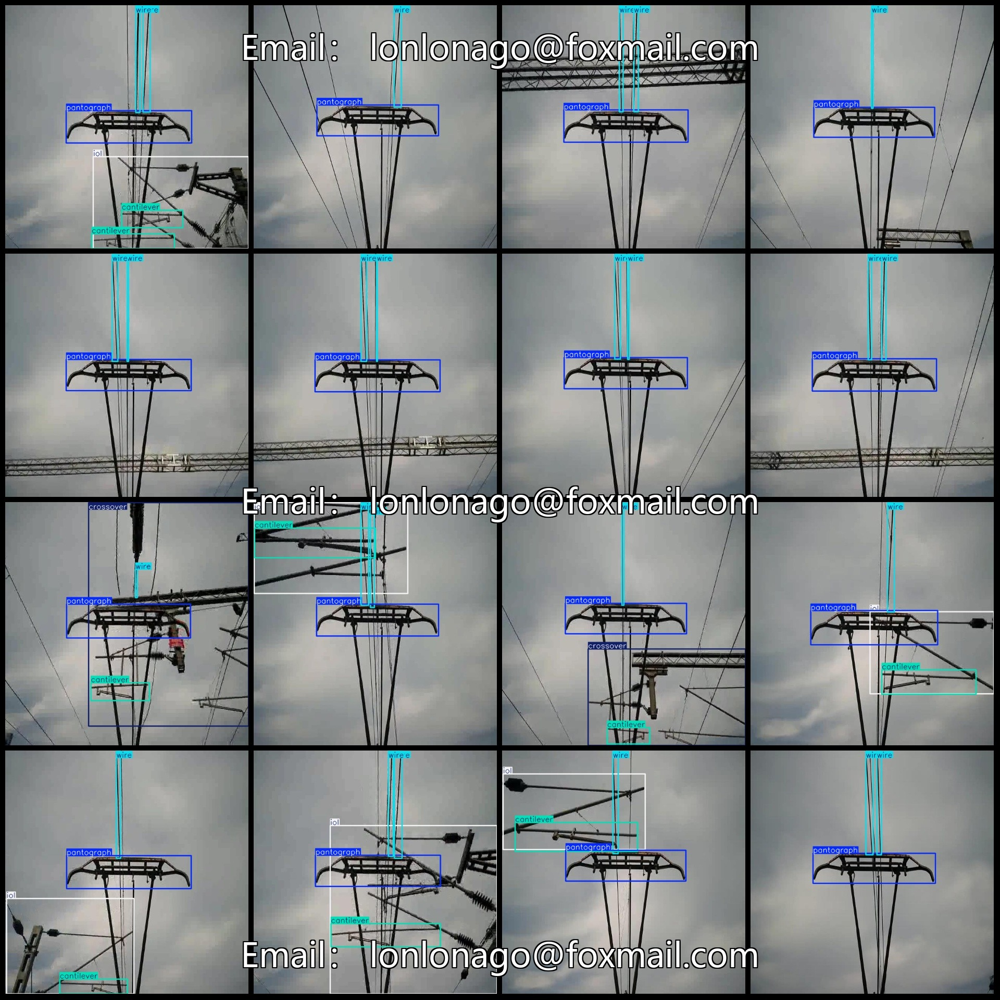

# Smart Railway High-Speed Electrification Catenary Inspection Data Set - VOC+YOLO Format with 443 Images and 6 Categories

Dataset format: Pascal VOC format + YOLO format (txt file without split paths, only including jpg images along with corresponding VOC format xml files and YOLO format txt files)
Number of images (jpg file count): 443
Number of annotations (xml file count): 443
Number of annotations (txt file count): 443
Number of annotation categories: 6
Annotation category names (note that the YOLO format category order does not correspond to this, and should be based on the labels folder's classes.txt): ["GJumper", "cantilever", "crossover", "iol", 
"pantograph", "wire"]
Number of bounding boxes per category:
- GJumper (grounding jumper) = 26
- cantilever (suspension) = 140
- crossover (crossing line/intersection) = 22
- iol (insulator string) = 141
- pantograph (electrified catenary) = 442
- wire (conductor) = 651
Total bounding box count: 1422
Image resolution: 640x640
Annotation tool used: labelImg
Annotation rule: draw a bounding box for each category
Important note: No specific statement provided
Special declaration: This dataset does not guarantee the accuracy of trained models or weight files
Image preview:

## Images

Here is a pay link on Stripe ( https://buy.stripe.com/3cs8yP7sY87d0vu9AB ). Please contact me lonlonago@foxmail.com after funding $89, and I will send you a complete data files , thank you!

